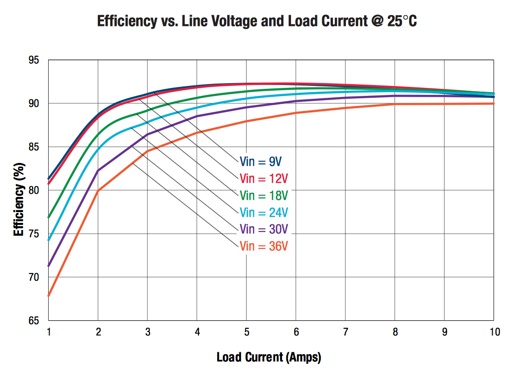

# NUC power supply board
For NUC7i5 and below we've been successfully using the 12V output on the [MATEK UBEC DUO](http://www.mateksys.com/?portfolio=u4a2p), which is rated to 60W (72W max) on 4-6S.
THe NUC7i5 comes with a 19V 65W power supply, and the NUC itself draws about 50W max.
The NUC8i3/5/7 come with a 90W power supply.
The NUC8i5 draws 70W on its own (max), so the UBEC DUO won't be enough.

This board uses a [DOSA standard](http://www.dosapower.com/) eighth-brick power supply module to power a NUC8i5 from a 4-6S LiPo/LiHV battery.
3S batteries will work as long as they start at least half-charged and the voltage is reliably above 9V.
7S and 8S batteries will also work with slightly lower efficiency (70% idle, 85% load vs 80% idle, 93% load), as long as the voltage never spikes over 50V.

It's designed for a [Murata UWE-12/10-Q12NB-C](https://www.digikey.co.nz/product-detail/en/murata-power-solutions-inc/UWE-12-10-Q12NB-C/UWE-12-10-Q12NB-C-ND/5168567) which is a 120W module, but any eighth-brick module will fit (with different performance).
Quarter-brick modules will fit as well, but they'll hang off the edge (and you'd probably get better thermal performance with a bigger PCB anyway).
Sixteenth-brick modules will also fit (with some wasted space).

For the NUC connector, I recommend [Tensility 10-01066](https://www.digikey.co.nz/product-detail/en/tensility-international-corp/10-01066/839-1166-ND/3507717) or equivalent (right angle 5.5x2.5mm barrel jack, no more than 11mm long, 18AWG or thicker wire).

Running a NUC8i5BEK from a 4S battery with the CPU at 100% and no air movement, the heat spreader reaches about 60ºC (too hot to hold but not too hot to touch).

## Specifications

* Input voltage: 9-36V (4-6S comfortably, 3-8S at a stretch)
* Input current: 15A (fused, switch to a 20A fuse for packs < 6S)
* Output voltage: 12V (trimmable ±10%, I've set it at 12.5V)
* Output current: 10A
* Max base plate temperature: 100C (no derating)
* Under-voltage protection: shuts down at ~8V, starts up at ~10V
* Over-current protection: current limits over ~13.5A
* Short-circuit protection: shuts down when output voltage drops below 98%, hiccups indefinitely with no damage
* Over-temperature protection: shuts down over ~140C
* Reverse polarity protection: no damage on current-limited supply, fuse blows otherwise
* Weight: 50g without connectors
* Dimensions: 23mm x 91mm x 23mm

## Reference information
The [NUC8ixBE Technical Product Specification](https://www.intel.com/content/dam/support/us/en/documents/mini-pcs/NUC8i3BE_NUC8i5BE_NUC8i7BE_TechProdSpec.pdf) says:

> 2.2.4.6 Power Supply Connector
>
> The board can be powered through a 12-19V DC connector on the back panel.
> The back panel DC connector is compatible with a 5.5 mm/OD (outer diameter) and 2.5 mm/ID (inner diameter) plug, where the inner contact is 12-19V DC ±10% and the shell is GND.
> The maximum current rating is 10A.
>
> 2.2.4.6.1 Power Sensing Circuit
>
> The board has a power sensing circuit that:
>   * Manages CPU power usage to maintain system power consumption below 90W.
>   * Designed for use with 90W AC-DC adapters.
>
> It is recommended that you disable this feature (via BIOS option) when using an AC-DC adapter greater than 90W.

The [NUC7ixBNB TPS](https://www.intel.com/content/dam/support/us/en/documents/mini-pcs/nuc-kits/NUC7i5BN_NUC7i7BN_TechProdSpec.pdf), [NUC6ixSYB TPS](https://www.intel.com/content/dam/support/us/en/documents/boardsandkits/NUC6i5SYB_NUC6i3SYB_TechProdSpec.pdf) and [NUC5ixRYB TPS](https://www.intel.com/content/dam/support/us/en/documents/mini-pcs/nuc-kits/NUC5i5RYB_NUC5i3RYB_TechProdSpec.pdf) say the same thing with 65W instead of 90W.

